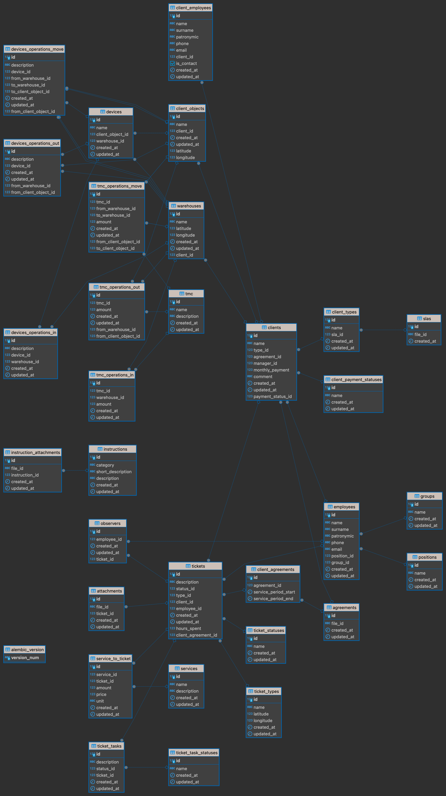

# CRM_Practice
___

## Описание
Проект представляет собой практикум по созданию CRM системы для компании, занимающейся outsource IT поддержкой.

___

## Сущности

  

    
<i>в виде гномиков</i>

  

___

## Сервисы

### Backend

Сервис, отвечающий за взаимодействие с базой данных и бизнес-логику. Реализован на FastAPI, использует SQLAlchemy для работы с базой данных.

Работа с базой данных происходит через репозитории, которые работают с доменными объектами. Для ускорения разработки репозитории генерируются через фабрику, в которой описываются базовые crud операции.

Для упрощения написания ручек создан генератор, который принимает на вход репозиторий и генерирует ручки для работы с ним. Так же есть возможность добавить свои ручки, которые будут работать с репозиторием. 

Реализована аутентификация через JWT токены, хранящиеся в куках. Для работы с токенами используется pyjwt.

Так же создан листенер для работы с Kafka, который слушает определенный топик и создает новые заявки в базе данных.

### ML 

Сервис, отвечающий за категоризацию новых заявок. Реализован на FastAPI, использует YandexGPT и собственные модели для категоризации заявок. При использовании YandexGPT также доступно очистка (перефразирование) текста запросов.

### Client-bot 

Телеграмм-бот, отвечающий за прием новых заявок. Реализован на python-telegram-bot, использует Kafka для отправки новых заявок в 'backend'.

### Frontend

Сервис, отвечающий за визуализацию данных и взаимодействие с сотрудниками. (Не)реализован на NiceGUI.

___

## Deployment

Для развертывания проекта используется docker-compose. Все сервисы развертываются в отдельных контейнерах, а также используется nginx проксирования запросов к контейнерам сервисов. 

___

## Технологии

- FastAPI
- SQLAlchemy
- PostgreSQL
- Kafka
- Nginx
- Docker и Docker-compose
- python-telegram-bot

___